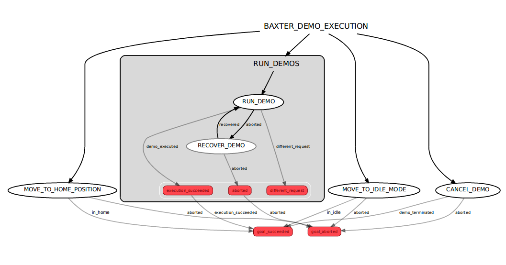
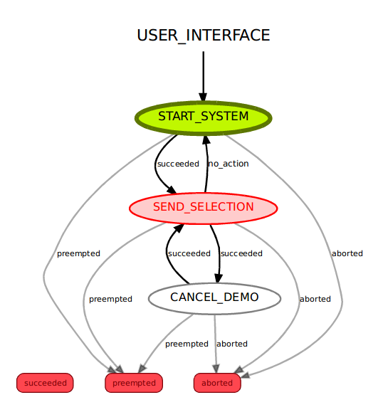

# Baxter Demo Manager

## 1. Overview
This project aims to develop an API for providing a well defined way of starting and stopping the Baxter as well as switching between demos on it. The API is extensible for adding new demos and can be used with different user interfaces(e.g keyboard, graphic user interface). To test, some of the demos in baxter_examples package are executed.

## 2. Tools

### 2.1 SMACH
[SMACH](http://wiki.ros.org/smach) is a python library for constructing hierarchical state machines. In this project, it is used to provide a smooth work flow, and to handle complex communication protocols behind the scene.

### 2.2 smach_viewer
[smach_viewer](http://wiki.ros.org/YAML%20Overview) is a GUI for especially debugging. It also pprovides an introspection of the statuses of each state in a SMACH construction.

### 2.3 Actionlib
[actionlib](http://wiki.ros.org/actionlib) is a powerful ROS package for long-running tasks. It is also used by SMACH for message communication

### 2.4 YAML
Describing a demo in a [YAML](http://wiki.ros.org/YAML%20Overview) file is very useful to be able to add more demos. Developers do not have to edit the base demo manager. 

### 2.5 Bondpy
[bondpy](http://wiki.ros.org/bondpy) is a ROS package that connects two different processes. Once a bond is created between process a and process b, one can know when and whether the other process either crahses or terminates cleanly.

### 2.6 Subprocess
[subprocess](https://docs.python.org/2/library/subprocess.html) is a python library that can be used for spawning new processes from a script. In this project, it is used for allowing user to run a demo remotely. 

## 3. Project Files
### 3.1 Demo Manager
```demo_manager.py ``` is constructed as a combination of SMACH containers; [Concurrence](http://docs.ros.org/jade/api/smach/html/python/smach.concurrence.Concurrence-class.html) container, and [State Machine](http://docs.ros.org/jade/api/smach/html/python/smach.state_machine.StateMachine-class.html) container. Actual work such as interacting with the Baxter, running/cancelling demos as well as generating bonds is done in this file. Below image shows the baxter_demo_manager SMACH container that consists of different states. 



The outer smach container (entire picture) is used as a concurrence container. This allows a result message to be sent right after a goal is requested. The square shape named ```RUN_DEMOS```, and all the other eliptic shapes out of this square are concurrence states inside the ```BAXTER_DEMO_EXECUTION``` concurrence container. All states get active concurrently but only one state does its job based on the goal message, others return a ```different_request``` outcome. For instance if the goal message is moving to home position, then only the ```MOVE_TO_HOME_POSITION``` state lets the Baxter move to home position while the rest of states return ```different_request```. The demo manager eventually returns either ```goal_succeeded``` or ```goal_aborted``` based on the success in each state. On the other hand, the ```RUN_DEMOS``` state is also a smach container. It is constructed as a state machine container. 

### 3.2 User Interface
```keyboard_control.py``` is the user interface for this project. It is constructed as a state machine container and its states consist of ```Simple Action States``` that advertise actionlib actions. The states of user interface state machine work in order unlikely the demo manager. Its work flow is controlled by the user input. Based on the keyboard inputs, the keyboard control user interface sends goal messages to be executed in the demo manager. The picture below shows the structure of the ui. 



Green color indicates the active state. The whole container starts with ```START_SYSTEM``` state asking the user hit enter from the keyboard. In ```SEND_SELECTION``` state works like a main list of demos to run. If there is no activity from user side within a certain amount of time the user interface sends a goal message to the demo manager to let the Baxter move to idle mode. This protects the Baxter's motors.

### 3.3 Actions and Messages
```UserInterface.action```, ```GetUserCommand.msg``` and ```GetResult.msg``` are used for message communication. The ```.action``` file has a goal and a result field. The goal field is a type of ```GetUserCommand``` and the result is a type of ```GetResult`` message. Message definitions are included in each file.

### 3.4 Yaml File
The ```demo_description.yaml``` file is where the demo maker defines the demo. It has a demo name, a command list and a bond description fields. Information about the demo is extracted by a class called ```YamlExtractor```. This class can return requested demo name, a list of command to be passed into subprocess and the bond description of each demo. The demo name that the user needs to input must match the demo name in yaml file.

### 3.5 RunDemo State Class
This class is important since it is where all the demos are traced. It is essential to know which node has crashed. Sometimes demos keep running even if one or more nodes crash. This affects the demo's functionality. By implementing a bond generation allows the demo manager to know whether any of the nodes in demo terminates. If we look into the execute method of that class;

```p
def execute(self, userdata):
		rd_goal = userdata.goal_from_ui
		rd_result = userdata.result_for_ui

		if rd_goal.ui_command.command == bdm.GetUserCommand.MOVE_TO_HOME_POSITION or \
		   rd_goal.ui_command.command == bdm.GetUserCommand.MOVE_TO_IDLE_MODE or \
		   rd_goal.ui_command.command == bdm.GetUserCommand.CANCEL_DEMO:
			return 'different_request'
			
		else:
			global p
			x = YamlExtractor(rd_goal.ui_command.command)
			
			if x.get_name() is not None:
				topics = x.get_topics()
				ids = x.get_bond_ids()
				bond_list = []
	
			# Generate bond instances
			for i in range(len(topics)):
				bond = bondpy.Bond(topics[i], ids[i])
				bond_list.append(bond)		

			ui_cmd = x.get_command()

			if p is None:
				p = subprocess.Popen(ui_cmd)
				rd_result.sys_result.result = bdm.GetResult.DEMO_EXECUTED

				def on_formed_cb():
					print "Bond has been formed"

				def on_broken_cb():
					print "Bond has been broken"
					if p is not None:
						nxr.terminate_process_and_children(p)
						#termination_publisher()

				for j in range(len(bond_list)):
					bond_list[j].start()
					bond_list[j].set_formed_callback(on_formed_cb)
					bond_list[j].set_broken_callback(on_broken_cb)
					bond_list[j].wait_until_formed()
				return 'demo_executed'

			else:
				rd_result.sys_result.result = bdm.GetResult.IS_ABORTED
				return 'aborted'
```
The first few lines are for userdata definition (userdata.goal_from_ui: goal message from the user interface and userdata.result_for_ui: result message to be sent by demo manager) and the if statement allows the state return a ```different_request``` outcome when another action is requested. 
```p
# Generate bond instances
			for i in range(len(topics)):
				bond = bondpy.Bond(topics[i], ids[i])
				bond.start()
				bond_list.append(bond)
```

Bonds are generated right before demo is executed. Each node must be included a bond with the same name as in yaml file. Let's say demo_foo consists of node a (node_a.py), node b (node_b.py) and node c (node_c.py). In yaml file, bonds field is constructed as a list of bond_a, bond_b and bond_c. Then node a (node_a.py) must be included a bond with the bond topic name and bond id of ```"bond_a"``` while the node b and c similarly must have bonds defined with a bond topic name and a bond id of ```"bond_b"``` and ```"bond_c"```. Once each bond instance is created, and added to a bond_list, the demo is executed with a name of "p". 

``` yaml
	demo_foo:
	    command: ['roslaunch', 'pkg_name', 'demo_foo_launch_file.launch']
	    bonds: ['bond_a', 'bond_b', 'bond_c']
```
demo_foo must be the name with which the user uses to run (e.g. if ui is keyboard then a string, "demo_foo" must be typed or if a GUI is used then it must generate a string named "demo_foo" when a button is pushed). Also each child node must include a bond definition. As an exampple for node a;

```p
# necessary imports
from bondpy import bondpy

# code here

if '__name__' == '__main__':
    try:
	rospy.init_node('node_a')
	bond = bondpy.Bond('bond_a', 'bond_a')
	bond.start()
	
	# call code here
	
	rospy.spin()
	
    except AttributeError:
    	bond.break_bond()
```
If the demo terminates after a while bonds will automatically be broken. If the demo infinitely runs then errors and exceptions can be included explicitly with ```bond.break_bond()```.  Please see baxter_examples [here](https://github.com/elmuhn/baxter_examples/blob/master/scripts/joint_velocity_wobbler.py) for reference


```p
	if p is None:
				p = subprocess.Popen(ui_cmd)
				rd_result.sys_result.result = bdm.GetResult.DEMO_EXECUTED

				def on_formed_cb():
					print "Bond has been formed"

				def on_broken_cb():
					print "Bond has been broken"
					if p is not None:
						nxr.terminate_process_and_children(p)
						#termination_publisher()

				for j in range(len(bond_list)):
					bond_list[j].start()
					bond_list[j].set_formed_callback(on_formed_cb)
					bond_list[j].set_broken_callback(on_broken_cb)
					bond_list[j].wait_until_formed()
				return 'demo_executed'
```

After creating a subprocess, the state starts each of the bonds and waits for one of them to terminate. With ```on_broken_cb```, all the children is terminated in case at least one node crashes. 

### 3.6 Other Files
```baxter.py``` is a class of robot description for Baxter provided by Rethink Robotics. It is used for interacting with Baxter for moving to home position and moving to idle mode actions.

```nxr.py``` is a file that has functions for terminating subprocesses. It is provided by Northwestern University NxR lab.

## 4. Future Work
User interface can be implemented different ways such as a GUI, a touch screen or a webpage. 
