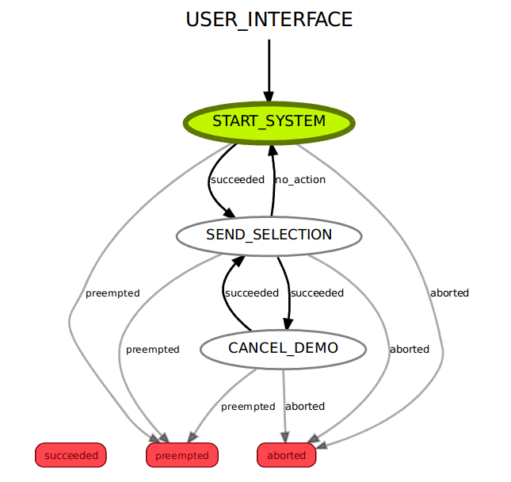

# Baxter Demo Manager

## 1. Overview
This project aims to develop an API for providing a well defined way of starting and stopping the Baxter as well as switching between demos on it. The API is extensible for adding new demos and can be used with different user interfaces(e.g keyboard, graphic user interface). 

## 2. Tools

### 2.1 SMACH
[SMACH](http://wiki.ros.org/smach) is a python library for constructing hierarchical state machines. In this project, it is used to provide a smooth worflow, and to handle complex communication protocols behind the scene.

### 2.2 smach_viewer
[smach_viewer](http://wiki.ros.org/YAML%20Overview) is a GUI for especially debugging. It also pprovides an introspection of the statuses of each state in a SMACH construction.

### 2.3 Actionlib
[actionlib](http://wiki.ros.org/actionlib) is a powerful ROS package for long-running tasks. It is also used by SMACH for message communication

### 2.4 YAML
Describing a demo in a [YAML](http://wiki.ros.org/YAML%20Overview) file is very useful to be able to add more demos. Developers do not have to edit the base demo manager. 

### 2.5 Bondpy
[bondpy](http://wiki.ros.org/bondpy) is a ROS package that connects two different processes. Once a bond is created between process a and process b, one can know when and whether the other process either crahses or terminates cleanly.

### 2.6 Subprocess
[subprocess](https://docs.python.org/2/library/subprocess.html) is a python library that can be used for spawning new processes from a script. In this project, it is used for allowing user to run a demo remotely. 

## 3. Project Files
### 3.1 Demo Manager
```demo_manager.py ``` is constructed as a combination of SMACH containers; [Concurrence](http://docs.ros.org/jade/api/smach/html/python/smach.concurrence.Concurrence-class.html) container, and [State Machine](http://docs.ros.org/jade/api/smach/html/python/smach.state_machine.StateMachine-class.html) container. Actual work such as interacting with the Baxter, running/cancelling demos as well as generating bonds is done in this file. Below image shows the baxter_demo_manager SMACH container that consists of different states. 


The outer smach container (entire picture) is used as a concurrence container. This allows a result message to be sent right after a goal is requested. The square shape named ```RUN_DEMOS```, and all the other eliptic shapes out of this square are concurrence states inside the ```BAXTER_DEMO_EXECUTION``` concurrence container. All states get active concurrently but only one state does its job based on the goal message, others return a ```different_request``` outcome. For instance if the goal message is moving to home position, then only the ```MOVE_TO_HOME_POSITION``` state lets the Baxter move to home position while the rest of states return ```different_request```. The demo manager eventually returns either ```goal_succeeded``` or ```goal_aborted``` based on the success in each state. On the other hand, the ```RUN_DEMOS``` state is also a smach container. It is constructed as a state machine container. 

### 3.2 User Interface
```keyboard_control.py``` is the user interface for this project. It is constructed as a state machine container and its states consist of ```Simple Action States``` that advertise actionlib actions. The states of user interface state machine work in order unlikely the demo manager. Its work flow is controlled by the user input. Based on the keyboard inputs, the keyboard control user interface sends goal messages to be executed in the demo manager. The picture below shows the structure of the ui. 



Green color indicates the active state. The whole container starts with ```START_SYSTEM``` state asking the user hit enter from the keyboard. In ```SEND_SELECTION``` state works like a main list of demos to run. If there is no activity from user side within a certain amount of time the user interface sends a goal message to the demo manager to let the Baxter move to idle mode. This protects the Baxter's motors.
